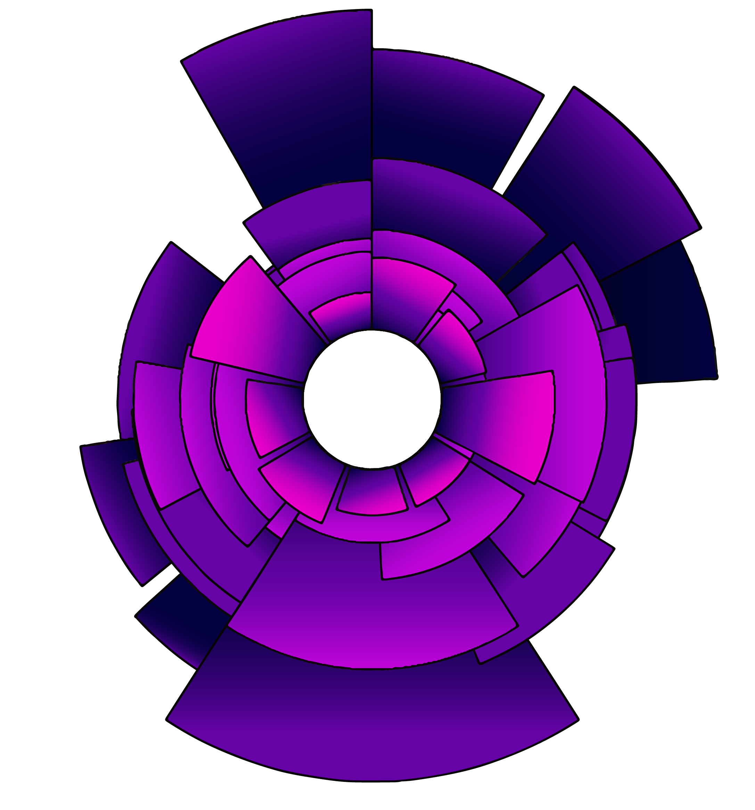

```{r setup, include=FALSE}
knitr::opts_chunk$set(echo = TRUE, warning = FALSE, message = FALSE)
library(tidyverse)
library(knitr)
library(lubridate)

```

## Running
A perk to living in the PNW is the opportunity to enjoy a wide range of outdoor adventures. As eagerly as I took up cycling, skiing, kayaking, hiking, and backpacking, I viewed running with distain. The sport seemed lack luster after numerous attempts to run with asthma. Sometimes it is the small things, like breathing, that really dominate experiences. 

Then, armed with a new inhaler, I made an impromptu decision to jog 0.75 miles to my friend's house instead of walking. A year later, I am making my final preparations for my first marathon. 

I have been tracking my running journey with Strava <https://www.strava.com/>, and while reflecting on of how far I have come, I decided to use the data to create something beautiful, a mini piece of art. 

Sometimes data can stream past our screen as rolling numbers, but it is a representation of so much more. It shows our successes, our failures, our illnesses, our recoveries, our mundane daily activities, and our once-in-a-lifetime experiences. In a world with a deluge of structured tables and scientific plots, it is just as appropriate to use the data to express something a bit more subjective, something beautiful just for the sake of pleasure.   

## The Data

Strava allows a wide range of data to be exported. I started with the primary file listing all my activities, dates, and distances.

```{r prepdata}

#load primary activity file
rundata <- read.csv("activities.csv")

#filter for activities that were runs
rundata <- rundata %>% filter(Activity.Type == "Run")

#update Activity.Date into a date format 
rundata$Activity.Date <- mdy_hms(as.character(rundata$Activity.Date))

#Add month/year variable for grouping. 
rundata <- rundata %>% mutate(Activity.Month = paste0(year(Activity.Date), 
                                                 "-", month(Activity.Date))) 
#Add counter variable to count each run within each month group
rundata <- rundata %>% group_by(Activity.Month) %>% 
  mutate(RowNum = row_number())

```

## Basic Plots

I setup a plot function that I could apply to each of the 14 months in my dataset. I aimed to have a circular styled plot layered with ever expanding bars to resemble rings of a tree or ripples in a pond. The bars measure the distance of each run, which get progressively longer as months passed. Since my purpose was to share the overarching feeling of my journey and not the specifics of each run, I stripped away all plot details.  

```{r plots}
#build function for picture export of each month group
plot_func <- function(X) {
 p1 <- rundata %>% filter(Activity.Month == X) %>% 
  ggplot(aes(x = RowNum, y= Distance))+
  geom_col(colour = "black")+
  labs(x=NULL, y=NULL)+
  ylim(-5,25)+
  theme(axis.ticks = element_blank(),
        plot.background = element_blank(),
        panel.grid = element_blank(),
        axis.text = element_blank())+
  coord_polar() 
p1

ggsave( filename = paste(X, ".png", sep = ""))
}

#Export plots
plot_func("2019-4")
plot_func("2019-5")
plot_func("2019-6")
plot_func("2019-7")
plot_func("2019-8")
plot_func("2019-9")
plot_func("2019-10")
plot_func("2019-11")
plot_func("2019-12")
plot_func("2020-1")
plot_func("2020-2")
plot_func("2020-3")
plot_func("2020-4")
plot_func("2020-5")

```

It took me a couple of tries to find an exporting method that produced a clean enough plot for easy editing in Adobe Illustrator. The resulting plots from R looked like this:


## Final Product
From here I imported all of the plots into Adobe Illustrator, layering them with the most recent (and longest) runs on the bottom to the beginning runs (and shortest) on top. I applied a range of color gradation from hot pink to dark blue to produce this final plot:    


